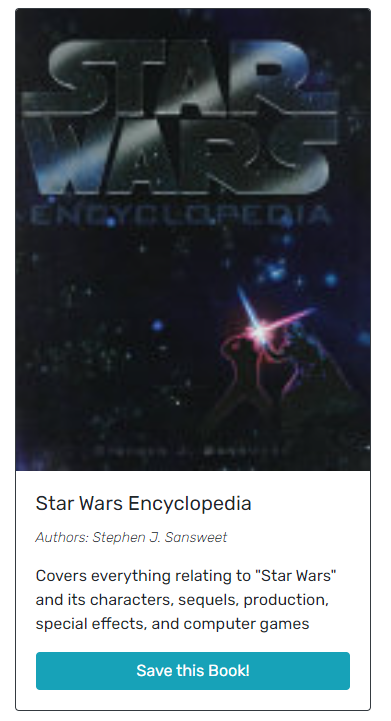
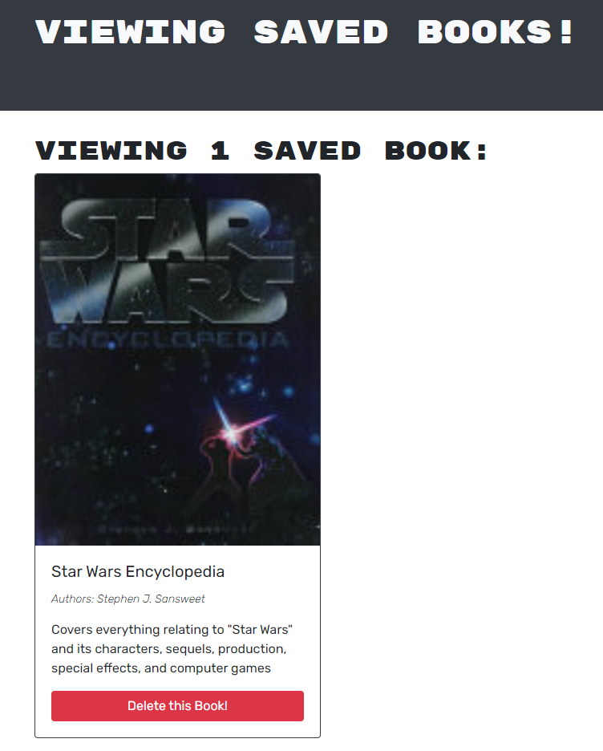

# book-search-engine

## Description 

This is a book search engine using google book search to find, view, and save books through ApolloGraphQL. It utilizes React, MongoDB, JWT, and Express

### [Deployed Link](https://salty-temple-46467.herokuapp.com/)

## Table of Contents

* [Installation](#installation)
* [Usage](#usage)
* [Credits](#credits)
* [License](#license)


## Installation

Clone repository and run on local machine or use deployed link above
To install necessary dependencies, run the following command:

```
npm i
```

To run the application when a rebuild is necessary, run the following command:

``` 
npm run develop
```


## Usage 

To use, search term in the search bar to return books:  


If you create an account or are logged in, you will be able to save books and view them on a personal page:  


This is the personal page, where you will be able to also delete books:  


## Credits

[Nodejs](https://nodejs.org/dist/latest-v16.x/docs/api/)

[Express](https://www.npmjs.com/package/express)

[MongoDB](https://www.mongodb.com/)

[Mongoose](https://mongoosejs.com/)

[Apollo GraphQL](https://www.apollographql.com/)

[Bcrypt](https://www.npmjs.com/package/bcrypt)

[JSON Web Token](https://www.npmjs.com/package/jsonwebtoken)

[JWT-decode](https://www.npmjs.com/package/jwt-decode)

[React](https://reactjs.org/)

[Bootstrap](https://getbootstrap.com/)


## License

[](https://opensource.org/licenses/MIT)
 This project is licensed under the MIT license.

## User Information

[Github](https://github.com/maverickwong17) |
[Email](wmaverick4@gmail.com) |
[LinkedIn](https://www.linkedin.com/in/maverick-wong-4488b4241/)

## Questions

If you have any questions about the repo, open an issue or contact me